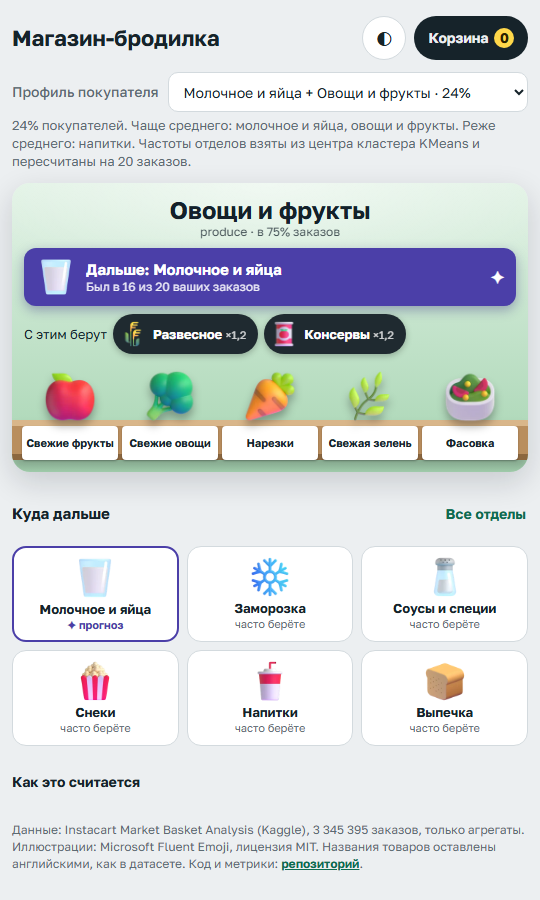
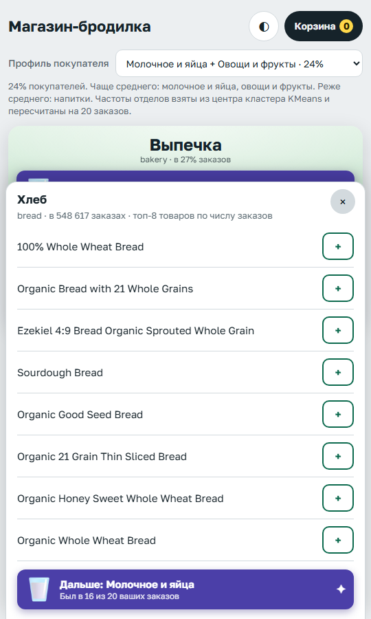
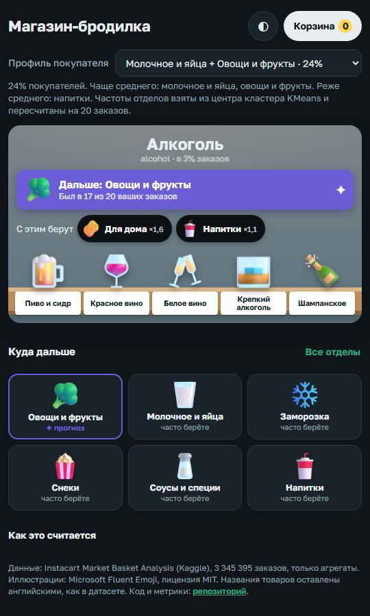

# Магазин-бродилка

Идея простая. Часть покупателей заходит в магазин или приложение без чёткого списка: «что-нибудь
к ужину», «закончилось что-то, не помню что». Такой человек листает категории и часто уходит,
купив меньше, чем мог бы. Я хотел проверить, можно ли по тому, что уже лежит в корзине, и по
истории покупок подсказать, куда пойти дальше, и показать это не списком, а как маленький
магазин с отделами и полками. Цель прикладная: сделать категории нагляднее для тех, кто не
определился, и за счёт этого немного поднять конверсию и средний чек.

Данные: [Instacart Market Basket Analysis](https://www.kaggle.com/datasets/psparks/instacart-market-basket-analysis)
с Kaggle, 3,3 млн заказов 206 тысяч покупателей. В нём есть поле `add_to_cart_order`, порядок,
в котором товары клали в корзину, и на нём можно строить честный таргет «следующий отдел».

**Демо:** https://mejick.github.io/recsys-store-walk/

<p>



</p>

## Постановка

Пример для модели: первые *k* товаров заказа (*k* от 1 до 8) плюс история покупателя, ответ:
отдел, которого в корзине ещё нет и который появится в ней следующим. Один заказ даёт
несколько примеров. Уровни: department (19 отделов, без `missing` и `other`) это локация,
aisle (132) это объект на полке, product это строка в списке.

Сплит по времени внутри пользователя: последний заказ каждого в test, предпоследний в val,
остальное в train. Признаки истории считаю только по заказам раньше текущего, таблицы lift и
переходов для модели пересчитаны только на train-заказах. Для скорости взял 25 тысяч
покупателей, размер сэмпла в конфиге.

## Что нашёл в данных

| | |
|---|---|
| Заказов / покупателей | 3 345 395 / 206 209 |
| Размер корзины, среднее / медиана / p90 | 10,1 / 8 / 20 |
| Отделов в заказе | 4,7 |
| Заказов из одного отдела | 9 % |

Lift между отделами (во сколько раз чаще случайного два отдела оказываются в одном заказе)
почти везде близок к единице: produce есть в 75 % заказов, dairy eggs в 68 %, с такими
частотами связи размываются. Сильные пары только в нишах: household и pets 2,5, alcohol и
pets 2,5, household и personal care 2,3. На уровне aisle всё гораздо живее: красное и белое
вино 39, вино и пиво 23, дезодоранты и гели для душа 12.

Направленные переходы и симметричный lift рассказывают разное. Alcohol и produce вместе
встречаются реже случайного (lift 0,67), но если человек только что положил алкоголь,
следующим новым отделом в 12 % случаев будет produce, выше базовых 9 %. Lift отвечает «кто с
кем», переходы отвечают «куда после», и для стрелки нужен второй сигнал.

## Модели и результат

Бейзлайны: глобальная популярность отделов, персональная популярность (частоты покупателя),
марковская цепь первого порядка по отделам и эвристика из моего прототипа (взвешенный ln lift
по корзине, lift к текущему отделу и история). Модель: CatBoost MultiClass (1 млн примеров из 1,9 млн train, ранняя остановка на 1400-й итерации из 2000) на 89 признаках,
среди них счётчики отделов в корзине, последний отдел и aisle, позиция в корзине, день недели,
час, дни с прошлого заказа, частоты отделов покупателя, доля повторных покупок и скоры двух
бейзлайнов. Отдельно попробовал ранжирующую постановку YetiRank на подвыборке.

Test, 130 158 примеров. Все методы ранжируют только отделы, которых ещё нет в корзине,
ничьи засчитываются против метода.

| Метод | hit@1 | hit@3 | MRR |
|---|---|---|---|
| Глобальная популярность | 0,214 | 0,506 | 0,418 |
| Персональная популярность | 0,309 | 0,620 | 0,509 |
| Марковская цепь | 0,249 | 0,518 | 0,442 |
| Эвристика прототипа | 0,186 | 0,472 | 0,393 |
| Эвристика с направленным lift | 0,248 | 0,542 | 0,450 |
| Формула демо: hazard-таблицы + история | 0,313 | 0,617 | 0,510 |
| **CatBoost MultiClass** | **0,320** | **0,627** | **0,518** |
| CatBoost YetiRank, подвыборка | 0,261 | 0,528 | 0,451 |

hit@3 по срезам:

| | k = 1 | k = 2–3 | k ≥ 4 | ≤ 4 заказов в истории | > 4 заказов | таргет не из топ-3 |
|---|---|---|---|---|---|---|
| Персональная популярность | 0,670 | 0,631 | 0,597 | 0,594 | 0,627 | 0,476 |
| CatBoost MultiClass | 0,678 | 0,641 | 0,603 | 0,602 | 0,634 | 0,480 |

Выводы, которые я для себя сделал:

- Задача перекошена в сторону популярных отделов: dairy eggs, produce и snacks дают 37 %
  таргетов. Поэтому история покупателя важнее корзины, а персональная популярность оказывается
  очень крепким бейзлайном.
- CatBoost обходит её везде, но всего на 0,7 пункта hit@3 и на 1,1 пункта hit@1. Главные признаки: счётчики корзины и
  скоры эвристики для dairy eggs, beverages и produce, потом доля повторных покупок.
- Моя первая эвристика проигрывает даже глобальной популярности. Виноват член «lift к
  текущему отделу»: он тянет в нишевые отделы (после алкоголя предлагал pets). Замена
  симметричного lift на направленный поднимает hit@3 с 0,47 до 0,54.
- Самая полезная находка про корзину: наивное P(следующий = L | в корзине есть c) врёт.
  Когда в корзине молочное, там почти всегда уже лежат и овощи, поэтому овощи «никогда не
  следующие» и выглядят непопулярными. Если считать вероятности только среди позиций, где L
  ещё нет в корзине, сигнал от корзины становится полезным. На этих таблицах собрана формула
  для демо: ln P(L | L ещё нет) + сумма по корзине + переход от текущего отдела + история.
  Она даёт 0,617 hit@3, то есть уровень персональной популярности, но при этом реагирует на
  корзину и работает для покупателя без истории. Веса подобрал на val так, чтобы корзина и текущий
  отдел меняли верхнюю подсказку заметно чаще (в 13 % случаев вместо 6 %) ценой 0,1 пункта hit@3.
- YetiRank на подвыборке остановился на 22-й итерации и проиграл, для честного сравнения ему
  нужен весь объём, это в планах.

Полные таблицы по val и test, важность признаков и пять разобранных примеров:
[`results/metrics.md`](results/metrics.md).

## Демо

Статический сайт без бэкенда. 19 отделов как локации, на полках aisle, отсортированные по
числу заказов, внутри топ-8 товаров. Одна стрелка «Дальше» с объяснением, откуда взялся
прогноз, плашки «С этим берут» по lift, персональная карта из шести ячеек, корзина в
localStorage и «демо-заказ», который дописывает отделы корзины в историю. Переключатель профиля
покупателя показывает, как меняются карта и прогноз: пять профилей это центры кластеров KMeans
по долям отделов у реальных покупателей, плюс «новый покупатель» без истории. Отделы, куда
ходят целенаправленно (pets), в подсказки не попадают. Светлая и тёмная тема, работает от 360 px.

В браузере считается формула из таблицы выше (строка «Формула демо») на тех же таблицах, что
лежат в `results/`, CatBoost статический сайт не запускает. Выигрыш модели показан офлайн.

## Как воспроизвести

Нужны Python 3.11, [uv](https://docs.astral.sh/uv/), GNU make и токен Kaggle
(`~/.kaggle/access_token` или переменная `KAGGLE_API_TOKEN`).

```bash
make setup      # .venv со всеми зависимостями
make data       # датасет (~700 МБ CSV) в data/raw
make features   # EDA-таблицы и примеры, около 2 минут
make train      # бейзлайны и CatBoost, около полутора часов на 12 потоках
make eval       # results/metrics.md
make site       # site/data, иконки, проверка, что числа на сайте совпадают с results/
python -m http.server -d site
```

Параметры в [`configs/default.yaml`](configs/default.yaml), seed зафиксирован. Сырые CSV в
репозиторий не входят, только агрегаты.

## Ограничения

Instacart это приложение, а не торговый зал, `add_to_cart_order` это порядок в корзине, а не
маршрут по магазину. Влияние подсказки на конверсию здесь не измерено: офлайн-метрика hit@3
говорит только о том, как часто стрелка указывает туда, куда человек и так пошёл бы, а
проверить эффект можно только A/B-тестом. Названия товаров оставлены английскими, отделы и
полки перевёл вручную.

## Лицензии

Код: MIT. Иллюстрации: [Microsoft Fluent Emoji](https://github.com/microsoft/fluentui-emoji), MIT.
Данные Instacart не распространяются, в репозитории только агрегаты, источник на Kaggle по
ссылке выше.
